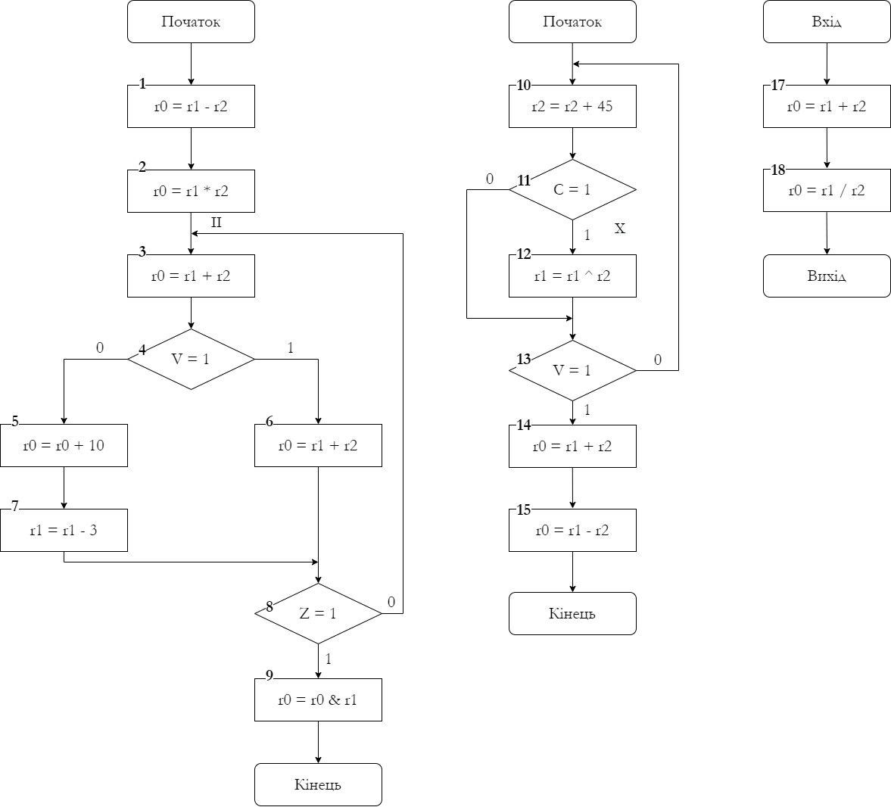
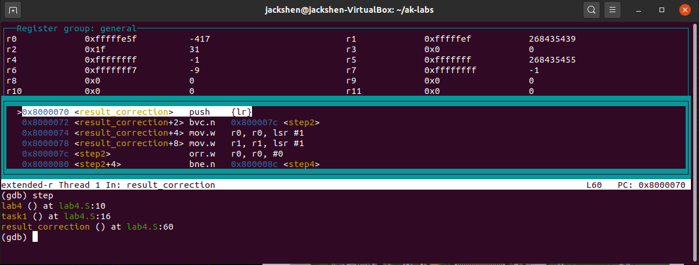
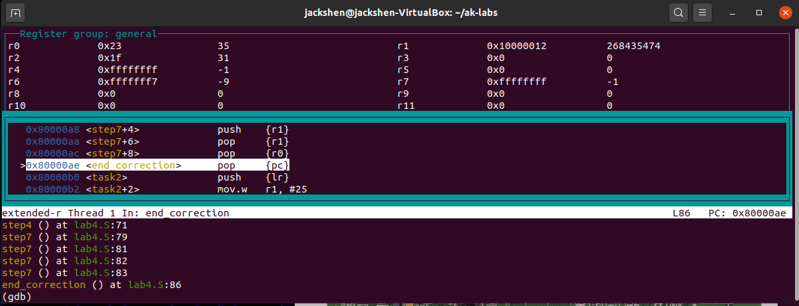
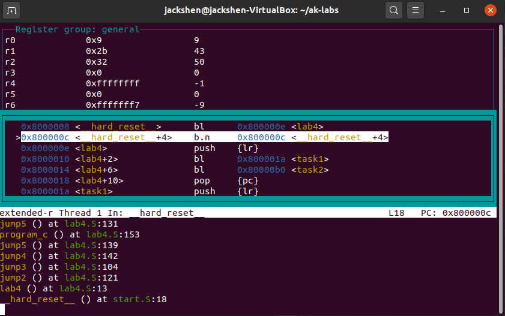

<h1 align="center"> Development of data processing programs for the Cortex M4 processor core</h1>

The aim is to study the architectural features, command systems, principles of organization of commands of conditional and unconditional transitions and transitions to subroutines, commands of work with memory and ways of addressing operands.


<h2 align="center">📝 Task</h2>

1. Develop a program in assembler to calculate the function specified in the table below, ensuring the formation of the result in the independently selected register. Use supplementary code to present the source data.

<center>

|                Function               | X1  | X2 | X3 | X4 |
|:-------------------------------------:|-----|----|----|----|
| `F = 8 * (X1 - X2) + (X3 ⊕ X4 - 1) / 16` | `-21`|`31` | `10` | `-9` |

</center>

2. Perform analysis of the established features and normalization of the result according to the algorithm below:
	1. Check the sign of the result (`F`) overflow outside the bit grid, if there was an overflow to correct the result by shifting the result to the right and writing the value of the overflow to the highest digit, if not, go to step 2;
	2. Check for zero of the lower part of the result `[Ry] = 0` (if so go to step 3, otherwise perform step 4);
	3. Write `8227` in the upper bits of the lower part of the number, go to step 4;
	4. Add the number `8227` to the highest part of the result, go to step 5;
	5. Determine whether there is a violation of normalization on the left (sign bits do not match), we assume that the result is given in the modified code - the two highest bits of the highest part of the result `[Rx]` - sign;
	6. Correct the result by shifting to the right by one digit;
	7. Check for overflow in character digits if the result is not stored in memory.
3. Develop an assembler program according to the algorithm below. The algorithms themselves are implemented in the form of subroutines. Provide access from the main program to the first subroutine and access of this subroutine to the second subroutine.

__Subroutine transition point number from main program__: `II`

__The transition point number from subroutine #1 to subroutine #2__: `X`

<p align="center">
  
</p>

4. Run the program in gdb, demonstrate the launch of the loaded program and output the result to the console.


<h2 align="center">📙 Results</h2>

The file `lab4.S` is the main one in this program, it implements 2 tasks at once:

<details>
<summary>Content of <cite>lab4.S</cite> (with comments)</summary><p align="left">

```assembly
.global lab4
.syntax unified

#define X1 #-21
#define X2 #31
#define X3 #10
#define X4 #-9

lab4:
	push {lr}
	bl task1
	bl task2
	pop {pc}

task1:
	push {lr}
	mov r0, X1
	mov r1, #0xFFFFFFFF

	mov r2, X2
	mov r3, #0

	mov r4, X3
	mov r5, #0

	mov r6, X4
	mov r7, #0xFFFFFFFF

	// Calculation: 8 * (X1 - X2) + (X3 ^ X4 - 1) / 16
	
	// X1 - X2
	sub r0, r2
	sbc r1, r3
	
	// 8 * (X1 - X2)
	lsl r0, #3
	lsl r1, #3
	
	// X3 ^ X4
	eor r4, r6
	eor r5, r7
	
	// X3 ^ X4 - 1
	sub r4, #1
	sbc r5, #1
	
	// (X3 ^ X4 - 1) / 16
	asr r4, #4
	lsr r5, #4

	// 8 * (X1 - X2) + (X3 ^ X4 - 1) / 16
	add r0, r4
	adc r1, r5
	
	bl result_correction
	pop {pc}
	
// Result correction
result_correction:
	push {lr}
	bvc step2
	lsr r0, #1
	lsr r1, #1
step2:
	orr r0, #0
	bne step4
	orr r1, #0
	bne step4
	mov r0, #0b00100011
step4:
	add r1, #0b00100011
	and r5, r1, #0xc0000000
	beq step7
	eor r5, #0xc0000000
	beq step7
	lsr r0, #1
	lsr r1, #1
step7:
	bvs end_correction
	push {r0}
	push {r1}
	pop {r1}
	pop {r0}

end_correction:
	pop {pc}

task2:
	push {lr}

	mov r1, #25
	mov r2, #5

program_a:
	// 1: r0 = r1 - r2
	sub r0, r1, r2
	
	// 2: r0 = r1 * r2
	mul r0, r1, r2
	
	bl program_b
jump3:
	// 3: r0 = r1 + r2
	add r0, r1, r2
	
	// 4: jump1
	bvs jump1
	
	// 6: r0 = r1 + r2
	add r0, r1, r2
	
	b jump2
jump1:
	// 5: r0 = r0 + 10
	add r0, #10
	
	// 7: r1 = r1 - 3
	sub r1, #3
jump2:
	// 8: jump3
	beq jump3
	
	// 9: r0 = r0 & r1
	and r0, r1
	pop {pc}

program_b:
	push {lr}
jump5:
	// 10: r2 = r2 + 45
	add r2, #45
	
	// 11: jump4
	bcs jump4
	
	bl program_c
	
	// 12: r1 = r1 ^ r2 
	eor r1, r2
jump4:
	// 13: jump5
	bvs jump5
	
	// 14: r0 = r1 + r2
	add r0, r1, r2
	
	// 15: r0 = r1 - r2
	sub r0, r1, r2
	
	pop {pc}

program_c:
	push {lr}
	
	// 17: r0 = r1 + r2
	adds r0, r1, r2
	
	// 18: r0 = r2 / r1
	udiv r0, r2, r1
	
	pop {pc}
```
</details>

Task 1 Result         |  Task 1 Result (After Normalization) |  Task 2 Result
:-------------------------:|:-------------------------:|:-------------------------:
 | |


Let's check the correctness of the calculation of problem 1:

```py
F = 8 * (X1 - X2) + (X3 ^ X4 - 1) / 16
F = 8 * (-21 - 31) + (10 ^ (-9) - 1) / 16

10 ^ -9 =>
	001010
	110111
    ------
    111101 => -3

F = 8 * (-52) + (-3 - 1) / 16
F = -416 - 1 = -417
```

Let's check the correctness of the calculation of problem 2:

**`Init Values:`** `r1 = 25`, `r2 = 5`

**`Step 1:`** `r0 = r1 - r2 = 20`

**`Step 2:`** `r0 = r1 * r2 = 125`

**`Step 3:`** `r2 = r2 + 45 = 50` - transition from the main program to the subroutine #1

**`Step 4:`** `r0 = r1 + r2 = 75` - transition from the subroutine #1 to the subroutine #2 (`C=1`)

**`Step 5:`** `r0 = r1 / r2 = 2`

**`Step 6:`** `r1 = r1 ^ r2 = 43` - subroutine #1

**`Step 7:`** `r0 = r1 + r2 = 93` - `V=1`

**`Step 8:`** `r0 = r1 - r2 = -7`

**`Step 9:`** `r0 = r1 + r2 = 93` - transition from the subroutine #1 to the main program (`V=1`)

**`Step 10:`** `r0 = r0 & r2 = 9` - `Z=1`

Everything works great!

<h2 align="center">🚀 How To Run</h2>

Build the project with make:

```sh
>>> make
```

Start the qemu emulator with make qemu:

```sh
>>> make qemu
```

In another terminal, start the gdb debugger with the command `gdb-multiarch firmware.elf`. And run the program step by step. Demonstrate the value of the registers.

```sh
(gdb) target extended-remote:1234
(gdb) layout regs
(gdb) step
```

Alternatively, once you’ve connected to the chip, you type `continue`, wait a few seconds, and then hit Ctrl+C. If it asks, ‘Give up waiting?’, enter y for ‘yes’. After the program has run for a bit and then stopped, you can enter the `info registers` or `layout regs` command

```sh
(gdb) target extended-remote:1234
(gdb) continue
(gdb) layout regs
```
